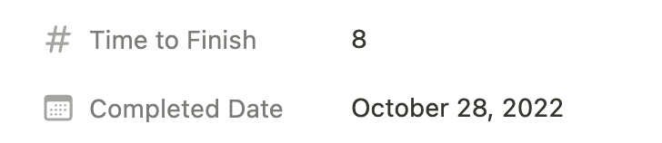

# Mochi Bot API

<p align="center">
  <a href="https://getmochi.co">
    
  </a>
</p>

<p align="center">
  
  
  <a href="https://github.com/consolelabs/mochi-api/blob/main/LICENSE">
    
  </a>
  <a href="https://discord.gg/DMVyp5Fr8Q">
  
  
  
  <a href="https://twitter.com/getmochi_bot">
  
  </a>
</p>

## Overview

This repository is official BE service for **[Mochi bot](https://www.notion.so/9f37233d00734759a1ed7f887e385169)**

## How to contribute

### Prerequisites

1. Go installed
2. Docker installed
3. [Set up discord bot](https://www.notion.so/ac75c9b08f54477ba4d8d8d20715adc3)
4. Owned a Metamask’s wallet. If not:
   1. [Install Metamask](https://metamask.io/download/) on your browser
   2. After successful installation, you will be redirected to Metamask’s **Getting started** page.
      Follow the steps to create your own wallet

### How to run source code locally

1. Set up source

   Set up infras (db, redis), install dependencies, etc.

   ```
   make setup
   ```

2. Set up env

   Update these variables inside `.env`, [How to get mnemonic](https://metamask.zendesk.com/hc/en-us/articles/360015290032-How-to-reveal-your-Secret-Recovery-Phrase)

   ```
   CENTRALIZED_WALLET_PRIVATE_KEY=“your metamask wallet mnemonic”
   DISCORD_TOKEN='your discord bot token'
   ```

3. Run source

   ```
   make dev
   ```

   You should see the service starting with port 8200 as default

### How to work on a TODO

1. Feel free to pick any TODO for you from [Board View](https://www.notion.so/2b9be3fffef74705830ad77058e35c95) → Mochi → Backlog\*\*
2. **Assign** that item to your account
3. Remember to update item’s **status** based on your working progress
   - `Backlog`: not started yet
   - `In Progress`: still working on
   - `In Review`: Task done = PR has been merged to `develop` branch at least
   - `Completed`: Confirmation from the team that the TODO is completely finished
4. When switching your TODO to `In Review`, remember to fill these in



### PR template

```markdown
**What does this PR do?**

- [x] New API for updating ...
- [x] Update logic of ...
- [x] Fix error ...

**How to test**

- cURL
- Steps to test new logic
- etc.

**Flowchart** (optional)
Should have if the flow is complex

**Media** (Demo) (optional)
Attach images or demo videos
Can insert video URL in case the size exceeds github limit
```

## Technical Document

1. **Project structure**

- `cmd/` this folder contains the main application entry point files for the project
  - `server/main.go`: Containing init function `main()` of the service. This function will be executed when we run `make dev`
  - Other `main.go` files (e.g. `fetch-discord-users/main.go`): Entry points to execute some functional jobs. k8s Cronjob will be set up to execute these jobs schedually
- `docs/`: contains Swagger documentation files generated by [swaggo](https://github.com/swaggo/swag)
- `migrations/`: contains seeds and SQL migration files
  - `schemas/`: contains DB schema migration files
  - `seed/`: contains seed files which will initialize DB with sets of dummy data
  - `test-seed/`: also seed files but for test DB
- `pkg/`: contains core source code of service
  - `cache/`: caching initial and functional methods
  - `chain/`: crypto chains’ initial and functional methods
  - `config/`: contains configs loaded from `.env`
  - `constants/`: constant variables
  - `discordwallet/`: methods to initialize & interact with crypto’s wallets (managed by Mochi)
  - `handler/`: handling API requests
  - `entities/`: where mainly core business logic happens, invoked by `handler` and `cmd`
  - `job/`: contains initial and `Run()` as execution functions. These are invoked by `main()` from `main.go` files (except `server/main.go`)
  - `logger/`: logging initial and functional methods
  - `model/`: DB model structs
  - `repo/`: data access layer, contains DB CRUD operations (see [gorm](https://gorm.io/))
  - `request/` & `response/`: API request & response models
  - `routes/`: API routing (see [gin](https://github.com/gin-gonic/gin))
  - `services/`: contains interaction with external services (coingecko API, binance API, etc.)
  - `util/`: utility methods

2. **Modules references**

- [Invite tracker](https://www.notion.so/Invite-tracker-40503e89ce40437c957f1eba1c87905d)

- [Assign Role & Default Role](https://www.notion.so/Assign-Role-Default-Role-d6f6fd10722c432cb4aba8d24d47e390)

- [Server Stats](https://www.notion.so/Server-Stats-dc76616935ab414d9b99e5655fad053e)

- [Level Role](https://www.notion.so/Level-Role-842c00dd9a6a45c19c03b9e5f5a56324)

- [PoE/Twitter](https://www.notion.so/PoE-Twitter-a19c7960ca0446aa9fc1d2530a999234)

- [Verify-wallet](https://www.notion.so/Verify-wallet-9a3d511920b5416195e634f7b7092255)

- [Tip bot](https://www.notion.so/Tip-bot-634c6fe98a144d6c86d3e9d77a04b90e)

- [Quest](https://www.notion.so/Quest-4f3f9c3932c74ecc875d9750755db134)

- [Price checker](https://www.notion.so/Price-checker-4c7a9ddca67e485284451216e152be4c)

- [NFT](https://www.notion.so/NFT-bc88b0a16fb7457d9621e35ddc5cc90d)

- [NFT Role](https://www.notion.so/NFT-Role-174945895e164d65a2b0df4f262a3cb1)

3. **Sample usecases**

   1. Create new API
      - Check out file `/pkg/routes/v1.go` and explore the code flow to see how to create and handle an API
      - Remember to annotate handler functions with [swaggo](https://github.com/swaggo/swag). Then run `make gen-swagger` to generate Swagger documentations
   2. New DB migration

      Check out `.sql` files under `/migrations` to write a valid schema migration / seed file

      - To apply new migration files, run `make migrate-up`
      - To apply seed files, run `make seed-db`
      - To apply new migration files for test DB, run `make migrate-test`

      **Note:** remember to run these 2 every time you pulling new code

      ```
      make migrate-up
      make migrate-test
      ```

   3. DB repositories

      Check out dirs under `/pkg/repo`
      **Note:** remember to run `make gen-mock` to generate mocks for new `store` file

## :pray: Credits

A big thank to all who contributed to this project!

If you'd like to contribute, please check out the [contributing guide](CONTRIBUTING.md).

[](https://github.com/consolelabs/mochi-api/graphs/contributors)

## Keep in touch

- Reach us at [discord](https://discord.gg/dddsYkB8Jw).
- Discuss development in the #build-with-us channel.
